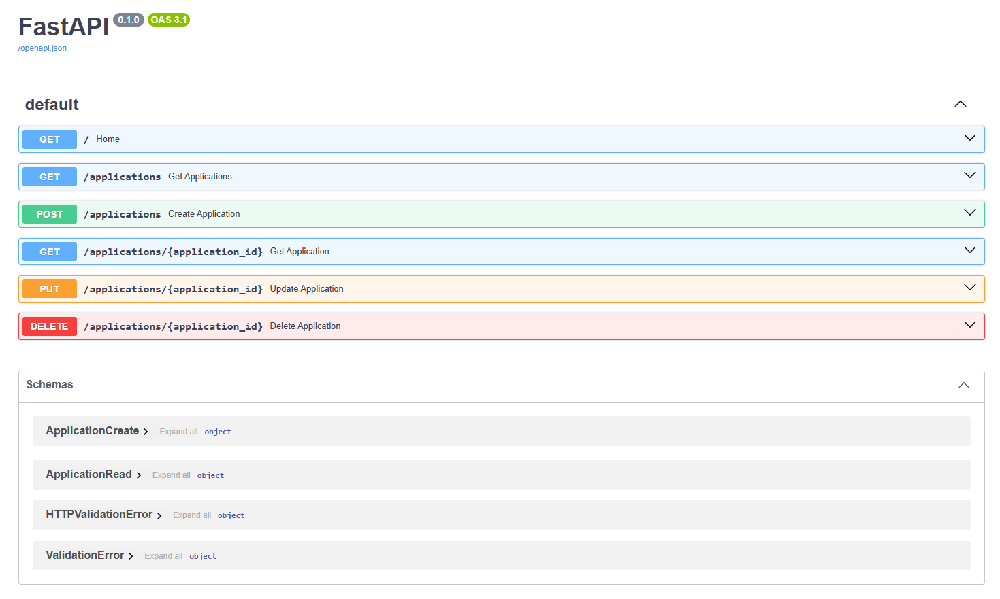

# Internship Application Tracker API

A RESTful API that was built with Python and FastAPI for tracking internship applications.



## Features

- Able to create internship applications
- Retrieve all applications or a specific application
- Update existing application records
- Delete application records
- Validate incoming application data
- Persist records by using SQLite and SQLAlchemy
- Automated API testing using Pytest

## Tech Stack

- Python
- FastAPI
- SQLite
- SQLAlchemy
- Pydantic
- Pytest

## Installation

Clone this repository and navigate into its directory.

Create a virtual environment:

```powershell
py -m venv .venv
.\.venv\Scripts\Activate.ps1
```

Install the dependencies:

```powershell
python -m pip install -r requirements.txt
```

## Running the Application

Start the development server:

```powershell
python -m uvicorn main:app --reload
```

Open the interactive API documentation:

http://127.0.0.1:8000/docs

The SQLite database is created automatically.

## API Endpoints

| Method | Endpoint | Description |
|---|---|---|
| POST | /applications | Create an application |
| GET | /applications | Retrieve all applications |
| GET | /applications/{application_id} | Retrieve one |
| PUT | /applications/{application_id} | Update an application |
| DELETE | /applications/{application_id} | Delete an application |

## Running Tests

Run the automated test suite:

```powershell
python -m pytest -q
```

The tests use a separate temporary SQLite database.

## Future Possible Improvements

- Authentication
- Filtering and searching
- Pagination
- Frontend dashboard